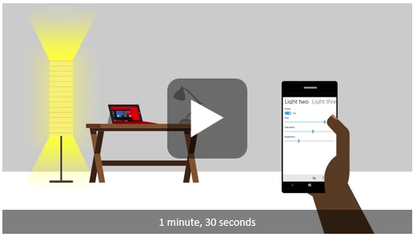
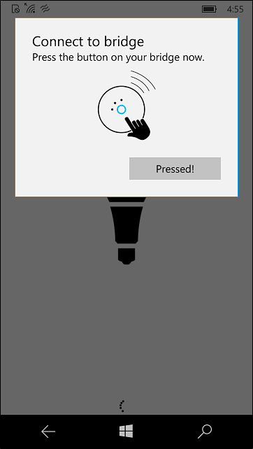
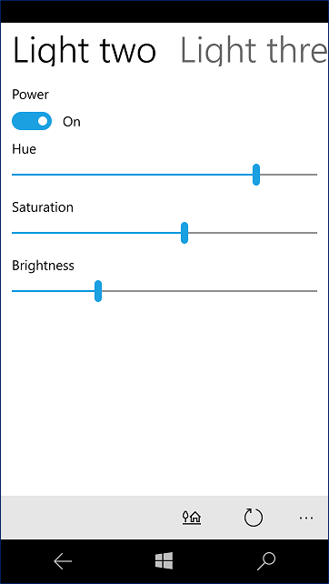

<!---
  category: DevicesSensorsAndPower SpeechAndCortana
-->

# Hue Lights sample

A mini-app that explores integrating Windows features with intelligent home automation. Specifically, it shows how you can use Cortana and Bluetooth Low Energy (Bluetooth LE) to create an interactive experience with the [Phillips Hue Lights](http://meethue.com) (a Wi-Fi enabled lighting system).

> Note - This sample is targeted and tested for Windows 10, version 2004 (10.0; Build 19569), and Visual Studio 2019. If you prefer, you can use project properties to retarget the project(s) to Windows 10, version 1903 (10.0; Build 18362).

This sample runs on the Universal Windows Platform (UWP). 

With Cortana integration, users are able to naturally interact with the lights through speech. They can turn the lights off, change their color, or even engage with Cortana in a back-and-forth conversation to adjust a specific light or change all the lights at once. 

Additionally, through Bluetooth LE, the app supports a proximity scenario where the lights are automatically turned on/off depending on a user's device relative to a Bluetooth LE beacon. 

## Features

The HueLightController app demonstrates:
    
* Using the HttpClient methods and Newtonsoft.json to interact with the Hue lights' RESTful interface. 
* Extending Cortana to provide an intuitive voice interface for manipulating the lights.
* Using BLE APIs in the background to watch for a BLE beacon indicating proximity to the lights. 
* Showing an extended splash screen for more time while the app connects to the Hue hub and searches for lights. 

## Universal Windows Platform development

### Prerequisites

- Windows 10. Minimum: Windows 10, version 1809 (10.0; Build 17763), also known as the Windows 10 October 2018 Update.
- [Windows 10 SDK](https://developer.microsoft.com/windows/downloads/windows-10-sdk). Minimum: Windows SDK version 10.0.17763.0 (Windows 10, version 1809).
- [Visual Studio 2019](https://visualstudio.microsoft.com/downloads/) (or Visual Studio 2017). You can use the free Visual Studio Community Edition to build and run Windows Universal Platform (UWP) apps.

To get the latest updates to Windows and the development tools, and to help shape their development, join 
the [Windows Insider Program](https://insider.windows.com).

## Running the sample

The default project is HueApp and you can Start Debugging (F5) or Start Without Debugging (Ctrl+F5) to try it out. The app will run in the emulator or on physical devices, though functionality related to Cortana and Bluetooth LE is dependent on hardware support. Specific requirements are:
* Phillips Hue lighting system (any version).
* A device running Windows 10 that is connected to the Internet, on the same local network as the Hue lights, and supports Bluetooth LE 4.0 or higher (for Bluetooth LE).  
* A second device that supports Bluetooth LE running the Windows 10 [Bluetooth advertisement sample](http://go.microsoft.com/fwlink/p/?LinkId=619990) to act as the proximity beacon. You can also use a standalone Bluetooth LE device, but you'll need to modify [HueLightController's code](HueApp/MainPage.xaml.cs#L98) to receive the correct signal. 

## Code at a glance

If you’re just interested in code snippets for certain API and don’t want to browse or run the full sample, check out the following files for examples of some highlighted features:

### Hue lights: 
* [Bridge.cs](HueLibrary/Bridge.cs#L25) handles core Hue interactions with the Hue hub, such as registering the app, finding lights, getting light state, and sending HTTP commands to the lights. 
* [Light.cs](HueLibrary/Light.cs#L25) represents a Hue light on the network. It contains properties such as on/off, color, brightness, and so on. Changes to these properties will be reflected on the actual light.  
* [HsbColor.cs](HueLibrary/HsbColor.cs#L25) converts standard aRGB colors (used in Universal Windows apps) to HSB (used by the Hue lighting system). 

### Extended splash screen: 
* [Initializer.xaml](HueApp/Initializer.xaml#L21) contains the image and layout to use for the extended splash screen. 
* [Initializer.xaml.cs](HueApp/Initializer.xaml.cs#L25) manages positioning the extended splash screen, loading all the relevant Hue resouces, and then dismissing the extended splash when finished.

### Cortana: 
* [VoiceCommands.xml](HueApp/VoiceCommands.xml) defines the structure of voice commands Cortana should recognize as Hue-related so that they can be routed to the HueLightController app. At first, VoiceCommands.xml only specifies the types of phrases Cortana is looking for - the actual words she accepts are added programatically by Initializer.xaml.cs. For example, VoiceCommands.xml states Cortana is listening for a phrase like "Turn my lights [color]," while Initializer.xaml.cs modifies VoiceCommands.xml to include the list of valid colors (red, blue, etc). 
* [Initializer.xaml.cs](HueApp/Initializer.xaml.cs#L25) prepares Cortana so she's ready to process Hue commands in the background, even if HueLightController isn't running. This includes dynamically modifying VoiceCommands.xml with the list of valid lights and colors. 
* [Cortana.cs](HueBackground/Cortana.cs#L25) receives voice commands from Cortana in the background, processes the user's request (including requesting clarification from the user, if needed), and then sends the appropriate command to the Hue lights. 

### Bluetooth LE: 
* [MainPage.xaml.cs](HueApp/MainPage.xaml.cs#L25) enables or disables the Bluetooth LE background proximity background watcher.
* [Bluetooth.cs](HueBackground/Bluetooth.cs#L25) processes Bluetooth LE advertisements and turns the lights on or off depending on the user's proximity to the beacon device.

## See also 

[Cortana interactions](https://msdn.microsoft.com/library/windows/apps/mt185598.aspx)  
[Display an extended splash screen for more time](https://msdn.microsoft.com/library/windows/apps/mt187309.aspx)  
[Bluetooth advertisement sample](http://go.microsoft.com/fwlink/p/?LinkId=619990)  
[Cortana voice command sample](http://go.microsoft.com/fwlink/p/?LinkId=619899)  
[Philips Hue Developer Program](http://www.developers.meethue.com/)

